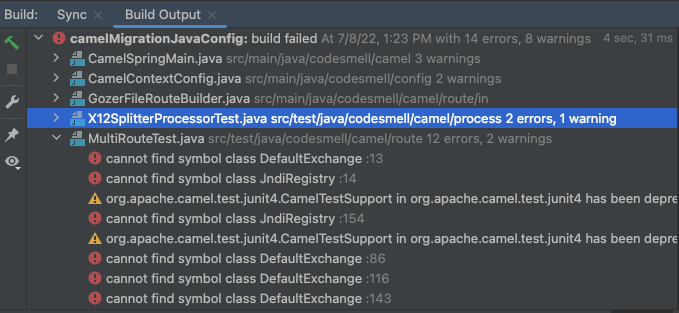
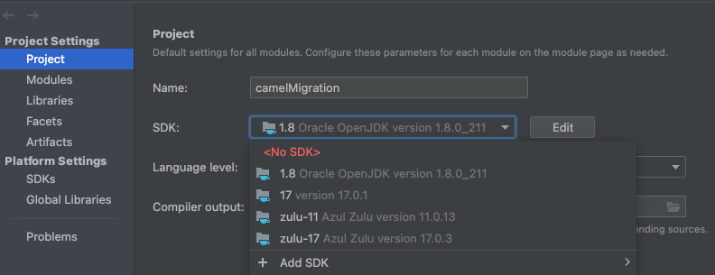

# Camel Migration
Exploring how to migrate a small Camel 2.x application to Camel 3.x

Camel is a very flexible framework that is designed around [Enterprise Integration Patterns (EIP)](https://www.enterpriseintegrationpatterns.com/).
The transition from the 2.x to 3.x represents a major and non-backward compatible change. The 3.0.0 release came out in November 2019.
This repo will explore how to use the various Camel migrations guides to migrate from Camel 2.x to Camel 3.x using a small application.

The application will be built using the Spring Java-Config capability to configure the `CamelContext`. 
This expects a configuration class to extend the `CamelConfiguration` which will allow configuration of Camel context.

The starting point:
- a small Camel 2.x application
- using Spring 5.x
- using JDK 8

The goal:
- a small Camel 3.x application
- using Spring 5.x
- using JDK 17

This application will consume EDI X12 messages from a directory and write them to a directory as JSON
(using [the Gozer parser](https://github.com/walmartlabs/gozer) and object model).

## Camel LTS releases
With 3.x Camel [moved to an LTS model like the JDK](https://camel.apache.org/blog/2020/03/LTS-Release-Schedule/).
The LTS versions will be supported for 1 year, be more stable and will not get new features.
The non-LTS versions will not have patch releases and will feature more innovations.
The LTS versions:
- 3.4.0 (EOL in June 2021)
- 3.7.0 (EOL in Dec 2021)
- 3.11.0 (EOL in June 2022)
- 3.14.0 (EOL in Dec 2022)
- 3.18.0 (EOL in July 2023)

Some major changes start with the non-LTS release of Camel 3.15.0
- [removes support for JDK 8](https://camel.apache.org/releases/release-3.15.0/)
- [removes support for spring-java-config](https://issues.apache.org/jira/browse/CAMEL-17354)

In addition, Camel 3.17 (non-LTS) will support JDK 17 as well as JDK 11

# Camel as a standalone application
This application is built using Camel `Main` which allows the [application to be run as a standalone Java application](http://people.apache.org/~dkulp/camel/running-camel-standalone.html)
(instead of packaging it up as a WAR). The application will run until it is terminated (Ctrl-C).

**Notes**
- Camel 2.25.x would not work with the Camel Spring Main standalone approach so decided to use the 2.24.x versions
- Camel Spring Main in 2.x requires a Spring XML file to kick things off

## Building and starting the application
Build the application

	mvn clean install

Run the application

	mvn camel:run

# The Migration Plan
- (**Starting point**) A Camel 2.24.x application
- (**Phase 1**) Migrate the Camel application from 2.24.x to Camel 3.14.x.
  - this moves the application to the current LTS (prior to major changes in 3.15)
  - it holds off on dealing with the JDK and Java-Config changes
- (**Phase 2**) Migrate the application from 3.14.0 to Camel 3.18.0
  - move to the latest LTS
  - move to JDK 17
  - evaluate options with Java-Config removal
- (**Phase 3**) Migrate the testing in the application from jUnit 4 to jUnit 5
  - remove need for deprecated Camel testing

The branch `camel2x` will contain the Camel 2.x version of the application
To access that version of the code locally

    git checkout tags/camel2x -b camel2xBranch

The branch `camel3xPhase1` will contain the Camel 3.x version of the application after phase 1 is completed
To access that version of the code locally

    git checkout tags/camel3xPhase1 -b camel3xPhase1Branch

The branch `camel3xPhase2Xml` will contain the Camel 3.x version of the application after phase 2 is completed
To access that version of the code locally

    git checkout tags/camel3xPhase2Xml -b camel3xPhase2Branch

The branch `camel3xPhase2Xml` will contain the Camel 3.x version of the application after phase 3 is completed
To access that version of the code locally

    git checkout tags/camel3xPhase3Junit5 -b camel3xPhase3Branch

The `main` branch will contain the Camel 3.x version of the application after phase 3 is completed

# Major Highlights for Camel Migration (Phase 1)
The [Apache Camel migration guide](https://camel.apache.org/manual/camel-3-migration-guide.html) is being used to start things off.

### Change the Camel version in the pom
Change the Camel version from

    <camel.version>2.24.3</camel.version>

To

    <camel.version>3.14.3</camel.version>

The majority of the errors will be in compiling the unit tests

Here are some run-time errors

    Caused by: org.apache.camel.spring.javaconfig.CamelSpringJavaconfigInitializationException: org.apache.camel.FailedToCreateRouteException: Failed to create route gozerSplitMessage at: >>> Log[Finished splitting X12 File into ${property.total.tx.sets} documents] <<< in route: Route(gozerSplitMessage)[From[direct:gozerSplitMessage] -> [... because of Unknown function: property.total.tx.sets at location 33
    Finished splitting X12 File into ${property.total.tx.sets} documents

### Looking at some of the changes
- the simple language `property` function was deprecated in Camel 2.x and has been removed. Use `exchangeProperty` instead.

         .log(LoggingLevel.INFO, "Finished splitting X12 File into ${exchangeProperty.total.tx.sets} documents")

- the `getMessage` method on the `Exchange` is the preferred approach to accessing the headers, body and other data over `getIn` and `getOut`
  -- Note: the `getOut` method was deprecated. The `getIn` was not. Since these methods return a `Message` this sample application was updated to use `getMessage` instead of `getIn`

### Getting the tests running again
- the `DefaultExchange` was imported from `import org.apache.camel.impl`. That needs to be changed to `org.apache.camel.support`

- the `JndiRegistry` and `createRegistry` are no longer needed.

          //
          // old way
          //
          @Override
          protected JndiRegistry createRegistry() throws Exception {
              JndiRegistry registry = super.createRegistry();
              registry.bind("x12SplitterProcessor", x12SplitterProcessor);
              return registry;
          }

         //
         // new way
         //
         context.getRegistry().bind("x12SplitterProcessor", x12SplitterProcessor);

- the `adviceWith` method was replaced with `AdviceWith`.

          //
          // old way
          //
          context.getRouteDefinition(CamelConstants.WRITE_FILE_ROUTE_ID).adviceWith(context, new RouteBuilder() {
          @Override
          public void configure() {
                  interceptSendToEndpoint(CamelConstants.OUTBOX_ENDPOINT)
                      .skipSendToOriginalEndpoint()
                      .to(MOCK_OUTBOX_ENDPOINT);
              }
          });

          //
          // new way
          //
          AdviceWith.adviceWith(context, CamelConstants.WRITE_FILE_ROUTE_ID, a -> {
              a.interceptSendToEndpoint(CamelConstants.OUTBOX_ENDPOINT)
                    .skipSendToOriginalEndpoint()
                    .to(MOCK_OUTBOX_ENDPOINT);
          });

- There were issues with using `AdviceWidth` when trying to intercept and mock an endpoint from `onException`
  -- solved it by creating a separate route to write the parser error file which could be intercepted 

# Major Highlights for Camel Migration (Phase 2)
Making the jump from 3.14.x to 3.18 is aided by checking out the changes in the non-LTS versions
- [Upgrading from 3.14 to 3.15](https://camel.apache.org/manual/camel-3x-upgrade-guide-3_15.html)
- [What's new in 3.15](https://camel.apache.org/blog/2022/02/camel315-whatsnew/)
- [What's new in 3.16](https://camel.apache.org/blog/2022/03/camel316-whatsnew/)
- [What's new in 3.17](https://camel.apache.org/blog/2022/05/camel317-whatsnew/)
- [What's new in 3.18](https://camel.apache.org/blog/2022/07/RELEASE-3.18.0/)

## Change the JDK
### Install JDK 17
- [Installing Azul Zulu JDK 17](https://docs.azul.com/core/zulu-openjdk/install/macos)
  This will be installed here by default

     /Library/Java/JavaVirtualMachines

### Change the JDK in the Terminal
A nice tool to manage multiple JDKs on the Mac [is jEnv](https://www.jenv.be/)

After installing Zulu 17 we need to add it to jEnv

    $> jenv add /Library/Java/JavaVirtualMachines/zulu-17.jdk/Contents/Home

Check all the JDKs managed by jEnv

    $> jenv versions
       * oracle64-1.8.0.211
       zulu64-1.8.0.212
       zulu64-11.0.13
       zulu64-17.0.3

Set the JDK to 17

    $> jenv global zulu64-17.0.3

### Change the JDK to 17 in the pom

    <maven.compiler.source>17</maven.compiler.source>
    <maven.compiler.target>17</maven.compiler.target>

### Change the JDK to 17 in your IDE

## Change the Camel version in the pom
Change the Camel version from

    <camel.version>3.14.3</camel.version>

To

    <camel.version>3.18.0</camel.version>

Doing a build will result in the following error:

    Unresolved dependency: 'org.apache.camel:camel-spring-javaconfig:jar:3.18.0'

So we will also have to remove that dependency from the pom file.

If we had not changed the JDK to 11 or higher there would also have been this error:

    class file has wrong version 55.0, should be 52.0

## Replace Spring Java-Config
With the [Spring Java-Config module](https://camel.apache.org/components/3.14.x/others/spring-javaconfig.html), an application could use helper classes to [configure the `CamelContext` in Spring](https://camel.apache.org/manual/camelcontext.html).
This was used in the Camel 2.x and initial migration to Camel 3.x.

    @Configuration
    public class CamelContextConfig extends CamelConfiguration {

This module was removed in Camel 3.15.

- delete `CamelContextConfig` class which relied on `CamelConfiguration`
- change `CamelSpringMain` which uses `org.apache.camel.spring.javaconfig.Main` 

### Main without Spring
The `...spring.javaconfig.Main` could be swapped out to use `org.apache.camel.main.Main`. 
However, that would seem to be a bigger change as our application relies on Spring to manage dependencies. 
For anyone interested in this approach [checkout the example in Camel repo](https://github.com/apache/camel-examples/tree/main/examples/main).

### Main with Spring
We will swap out the  `...spring.javaconfig.Main` with `org.apache.camel.spring.Main`. 

We will replace the following:

    org.apache.camel.spring.javaconfig.Main camelSpringMain = new Main();
    camelSpringMain.setBasedPackages("codesmell.config");

with the following:

    ApplicationContext ctx = new ClassPathXmlApplicationContext("META-INF/spring/beans.xml");
    org.apache.camel.spring.Main camelSpringMain = new Main();
    camelSpringMain.setApplicationContext((AbstractApplicationContext) ctx);

This approach relies on a Spring XML file to kick things off. However, we can still use Java DSL to define our Camel routes. 
We just are using the XML to let Camel configure our `CamelContext`. We will reply on component scanning to manage the rest. 

    <!-- 
        this is similar to doing this 
        camelSpringMain.setBasedPackages("codesmell.config");
    -->
    <context:component-scan base-package="codesmell.config"/>
    
    <camelContext id="camel" xmlns="http://camel.apache.org/schema/spring">
        <contextScan/>
    </camelContext>

To get all of this working we need to add the following dependencies to the pom file
  
    <dependency>
        <groupId>org.apache.camel</groupId>
        <artifactId>camel-spring-main</artifactId>
        <version>${camel.version}</version>
    </dependency>  
    <dependency>
        <groupId>org.apache.camel</groupId>
        <artifactId>camel-spring-xml</artifactId>
        <version>${camel.version}</version>
    </dependency>

# Major Highlights for Camel Migration (Phase 3)
In this next phase we replace the way we are testing Camel.

## Upgrade unit tests
As we migrated from Camel 2.x to Camel 3.x we see that the `org.apache.camel.test.junit4.CamelTestSupport` is deprecated.
As part of moving an older application forward we will upgrade the application to use jUnit 5 and the newer Camel test support.

This page will help manage the migration to jUnit 5 in Camel ([link](https://camel.apache.org/components/3.18.x/others/test-junit5.html))
There are a variety of approaches to testing in Camel using jUnit 5 ([link](https://camel.apache.org/components/3.18.x/others/test-spring-junit5.html))

This article contains a good overview of the changes between jUnit 4 and 5 ([link](https://www.arhohuttunen.com/junit-5-migration)).
The migration can be managed incrementally as jUnit 4 and jUnit 5 can coexist.

Remove jUnit 4 and add jUnit 5 to the pom

    <dependency>
        <groupId>org.junit.jupiter</groupId>
        <artifactId>junit-jupiter</artifactId>
        <version>5.8.2</version>
        <scope>test</scope>
    </dependency>

Remove the `camel-test` dependency and add `camel-test-spring-junit5`

    <dependency>
        <groupId>org.apache.camel</groupId>
        <artifactId>camel-test-spring-junit5</artifactId>
        <version>${camel.version}</version>
        <scope>test</scope>
    </dependency>

In the unit tests change the various imports for jUnit
Some examples:
- the import for `@Test`
- change `@Before` to `@BeforeEach`
- the import for assertions (assertTrue etc)

Open up `MultiRouteTest` and change the class it extends.
From:

    @RunWith(SpringJUnit4ClassRunner.class)
    @ContextConfiguration(classes = { BeanConfig.class, CamelRoutesConfig.class})
    @DirtiesContext(classMode = DirtiesContext.ClassMode.AFTER_CLASS)
    public class MultiRouteTest extends CamelTestSupport {

To:

    @CamelSpringTest
    @ContextConfiguration(classes = {BeanConfig.class, CamelRoutesConfig.class})
    @DirtiesContext(classMode = DirtiesContext.ClassMode.AFTER_CLASS)
    public class MultiRouteTest {

There is a fair bit of changes that are still reqiured.

In our setup method we had the following:

    @BeforeEach
    @Override
    public void setUp() throws Exception {
        super.setUp();

        mockOutboxEndpoint = getMockEndpoint(MOCK_OUTBOX_ENDPOINT);
        mockParserErrorEndpoint = getMockEndpoint(MOCK_PARSER_ERROR_ENDPOINT);

        context.getRegistry().bind("x12SplitterProcessor", x12SplitterProcessor);

        context.addRoutes(gozerInRoute);
        context.addRoutes(gozerTxSetRoute);
        context.addRoutes(gozerEndRoute);

    }

A lot of this is taken care of for us. We can remove the `setUp` method. Along with removing this method we can also remove the `@Autowired` routes.
    
    @Autowired
    @Qualifier("gozerFileRoute")
    RouteBuilder gozerInRoute;

Now let's fix the mock endpoints. 
We already removed the `setup` but in that method we configured the mock endpoints as follows:

    private MockEndpoint mockOutboxEndpoint;
    
    // this was in setup method
    mockOutboxEndpoint = getMockEndpoint(MOCK_OUTBOX_ENDPOINT);

That gets replaced with the following:

    @EndpointInject(MOCK_OUTBOX_ENDPOINT)
    private MockEndpoint mockOutboxEndpoint;

Most of the test methods verified that the mock test conditions using this approach:

    this.assertMockEndpointsSatisfied();

That needs to change to the following:

    mockOutboxEndpoint.assertIsSatisfied();
    mockParserErrorEndpoint.assertIsSatisfied();

We also need to make sure that the mocks are reset after each test:

    @AfterEach
    public void cleanup() {
        mockOutboxEndpoint.reset();
        mockParserErrorEndpoint.reset();
    }

Finally, we need to have access to the `CamelContext`

Let's start by adding the following:

    @Autowired
    private CamelContext context;

This test class will load a Spring XML file that is in the same package with the naming pattern `className-context.xml`. 
We need to add that file to the same package as the test class. 
This file is a simplified version of the `beans.xml` file in `src\main\resources`.

Note: I could not get the tests to run in the IDE without specifying the location to the XML file in the `@CamelConfiguration` and moving the XML file to the `src/test/resources` folder.

    @CamelSpringTest
    @ContextConfiguration(
    locations = {"classpath:MultiRouteTest-context.xml"},
    classes = {BeanConfig.class, CamelRoutesConfig.class})
    @DirtiesContext(classMode = DirtiesContext.ClassMode.AFTER_CLASS)
    public class MultiRouteTest {

Note 2: Running the tests from the command line (`mvn test`) also did not work until the `maven-surefire-plugin` was added to insure jUnit 5 was used.

    <plugin>
      <groupId>org.apache.maven.plugins</groupId>
      <artifactId>maven-surefire-plugin</artifactId>
      <version>3.0.0-M7</version>
      <dependencies>
          <dependency>
              <groupId>org.junit.jupiter</groupId>
              <artifactId>junit-jupiter-engine</artifactId>
              <version>${junit5.version}</version>
          </dependency>
      </dependencies>
  </plugin>